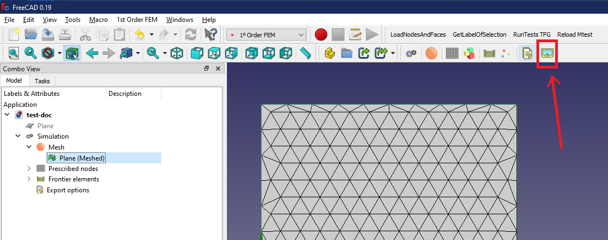

# First Order Finite Elements Method Python

## Environment information
Once the `workbench` is installed, it would expect to have a file called `.env` in the root of the project. Its content may very depending if one is developing or just using the `workbench` as a final user. 

An example of the said file is give:

```
# Project env variables
APP_ENV="prod"
PARAVIEWPATH="C:\\Program Files\\ParaView 5.5.2-Qt5-Windows-64bit\\bin\\paraview.exe"
```

## Examples
The main purpose of the package is to run first order simulation to solve Laplace's equation. 

For this to work, it would be needed a triangle-based mesh with correct numeration of nodes and faces. 

Then, a object of type `Simulation` should be generated and attached to the active document. This object would contain:
- A `Mesh` container
- A `Prescribed nodes` container where those nodes with fixed voltages should be defined (under `Prescribed node` container)
- Similarly, a `Frontier faces` container would contain those elements in which the charge would be calculated using the derived Electric Field vector (under `frontier faces`)
- Finally, some `Export options` can be defined in the relevant container
    - Results can be exported and viewed as a `vtu` file if the `render option` is chosen to `VTK`
    - Results can also be represented directly in `FreeCAD` using `matplotlib` dependency, out of the box. This kind of export has two possible subtypes: `cartesian` and `middle points`. Given the kind of output representation, `cartesian` means to divide the computational domain evenly on `x` and `y` direction by the points entered. If `middle points` is chosen, the `center` of each element (`triangles`) would be used to represent there `voltage` and `electric field`

The `Simulation` object contains an output text area in which relevant information woudl be written after the simulation finished. By pressing `Run Simulation`, a `thread` would be created and it would run the simulation, non blocking `FreeCAD` UI. 

In general, a simulation consists in a given `Mesh` with some fixed voltages in certain nodes. The result of the simulation would be a file called `solution.json` where node's voltages could be checked, for all nodes in the mesh. 

After having a valid solution, some exports can be made so that `voltages` and `electric field` can be represented, as well as charge in certain surfaces can be calculated.

By clicking `Run export`, it would be expected to have a `solution.json` file already in disk. 

Every `FreeCAD` file would have a mirror folder, in the same path, where the output files would be written.

Multiple examples for the version `v0.1.2` of the `workbench` and `FreeCAD v0.19` can be found in [docs\examples](examples) folder

### Capacitor
As an example, a capacitor would be simulated here. Start by creating a blank `FreeCAD` project and store in any path of preference in the computer. 


Create a plane using `Part` workbench


Mesh it with `Mesh` workbench. The example shows a `mefisto`-based mesh with `1 mm` default side for a `10x10` mm plane


The mesh has 228 points (nodes) and 414 faces (elements). Continue creating a empty simulation under `1º Order FEM` workbench


Drag and drop the `mesh` object to `Mesh` container


Create `node` and `face` tags by using the auxiliary command



This would result in the creation of folder with different `text` object where its label points to the unique identification of whether `node` or `face`.


Create groups of `Prescribed nodes` container with relevant `voltage` values and place there each `node`


Optionally, do the same with the `element` where the charge is desired to be calculated

As a hint, you can either drag and drop the `text` object to its relevant groups or select those direclty on `3D` view by using `Shift + B` or `Box selection` option

At the end, this simulation contains nodes with fixed voltage of 1V to the left side of the capacitor and 0V to the right. Similarly, charge would be calculated in both sides


Finally, run the simulation by double-clicking the `Simulation` object and then, click on `Run Simulation`


In the output text area, you would see the total elements energy as well as the desired charge on each side (same value with different sign). As `VTK` export option was selected, `ParaView` would open (if you have the path configured in the `.env` file), showing the results.

Voltage:


Electric Field:


Here, it is possible to perform multiple options in `ParaView` to check results. Beside `ParaView` results, an equal number of folders would be created in the project showing the direction of the normals used to calculate the charge. Consider this if any sign may differ of what is expected


Either way, one can come back to `Simulation` and click on `Run Export`, changing the export options to `matplotlib` representation. You can check the `cartesian` grid with 25 points per direction or the `middle point`, directly.


Last but not least, the folder created in the path chosen would contain every information used to make the representations:


